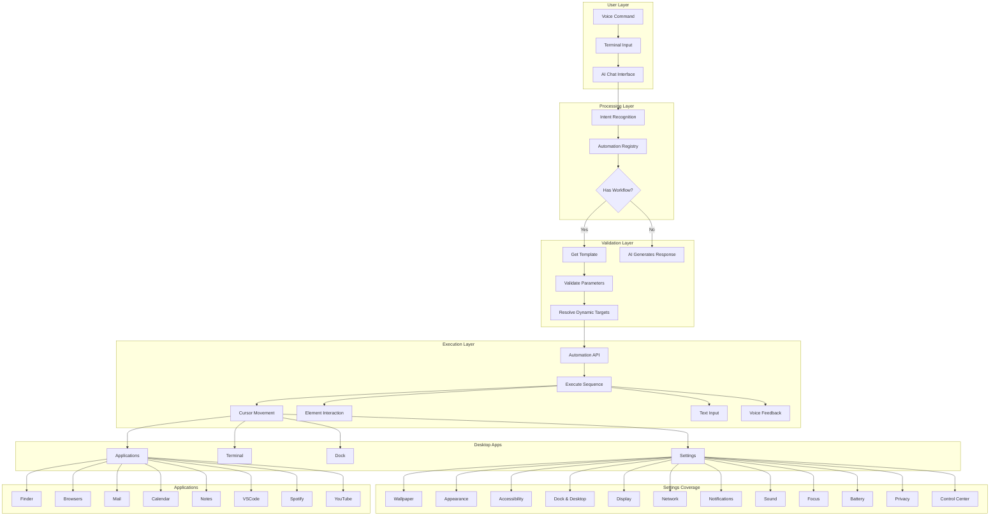
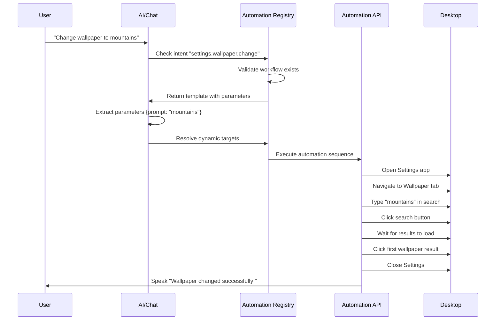
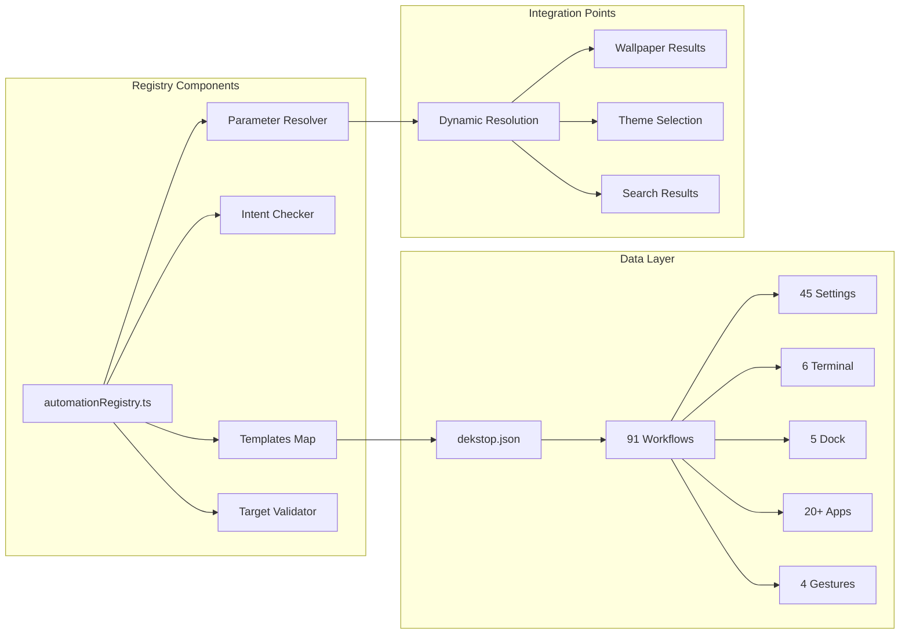
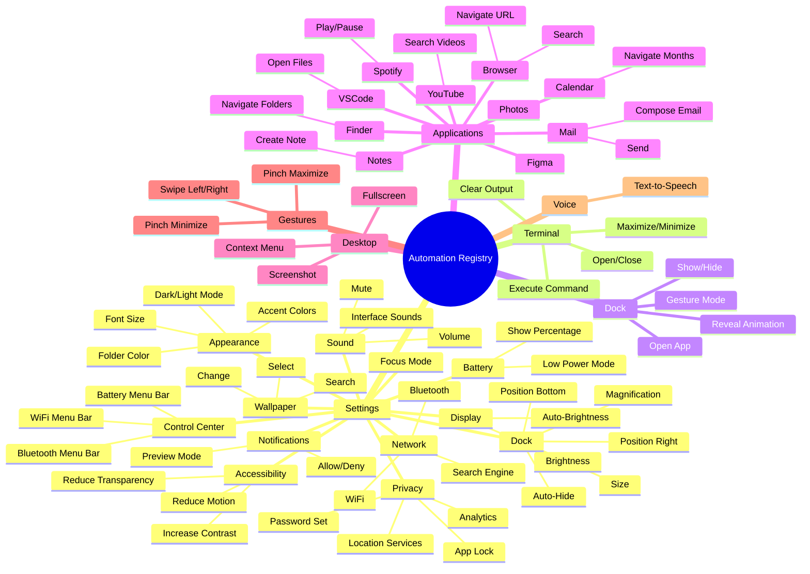
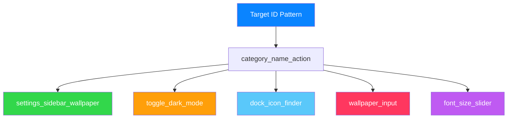
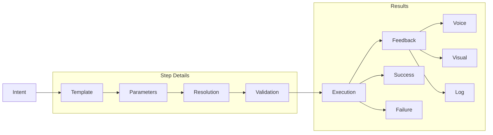

# SmartyAI Automation Registry Architecture



## Workflow Sequence Flow



## Automation Registry Structure



## Complete Workflow Coverage Map



## Target ID Naming Convention



## Automation Execution Pipeline



## Workflow Statistics Dashboard

```
┌─────────────────────────────────────────────────────────┐
│          AUTOMATION REGISTRY STATISTICS                 │
├─────────────────────────────────────────────────────────┤
│                                                          │
│  Total Workflows:        91              ████████████   │
│  Validation Success:     100%            ████████████   │
│  Target IDs:             91              ████████████   │
│  Parameters:             13              ███            │
│                                                          │
├─────────────────────────────────────────────────────────┤
│  BY CATEGORY                                            │
├─────────────────────────────────────────────────────────┤
│  Settings:               45             ██████████     │
│  Terminal:               6              ██             │
│  Dock:                   5              ██             │
│  Window Management:       6              ██             │
│  Applications:           20+            ████████        │
│  Desktop Actions:        3              █              │
│  Gestures:               4              █              │
│  Voice:                  1              █              │
│                                                          │
├─────────────────────────────────────────────────────────┤
│  TOP FEATURES                                            │
├─────────────────────────────────────────────────────────┤
│  ✓ Complete Settings Coverage                           │
│  ✓ Dock Position (Bottom/Right)                         │
│  ✓ Dynamic Wallpaper Selection                          │
│  ✓ All Apps Automated                                   │
│  ✓ Gesture Integration                                  │
│  ✓ Voice Feedback                                       │
│                                                          │
└─────────────────────────────────────────────────────────┘
```

---

**Generated:** 2026-08-11  
**Visualization:** Mermaid Diagrams  
**Status:** Complete Architecture Overview
