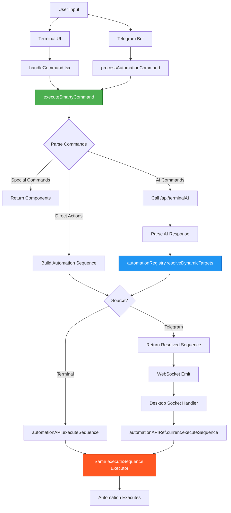
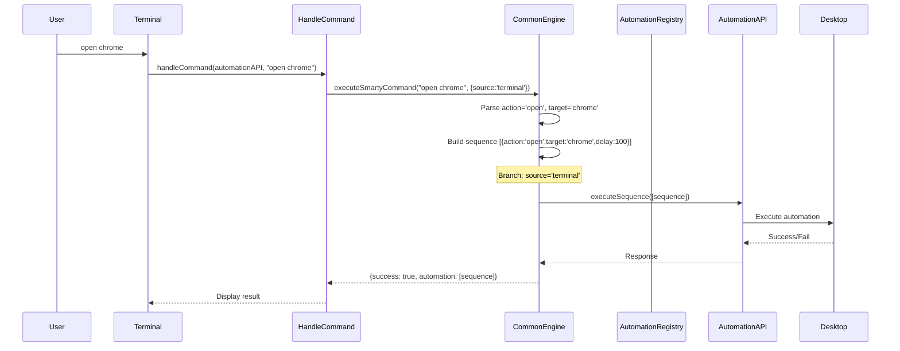
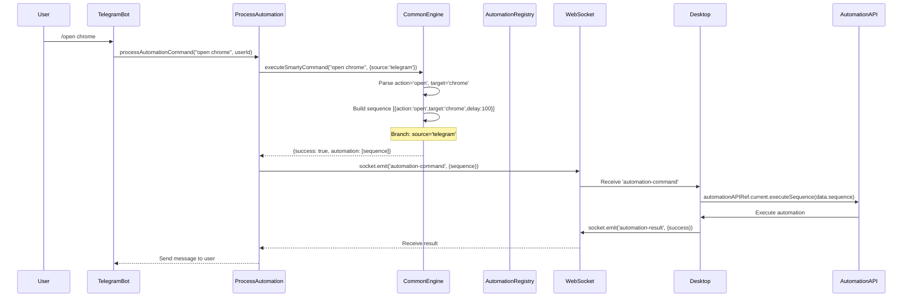
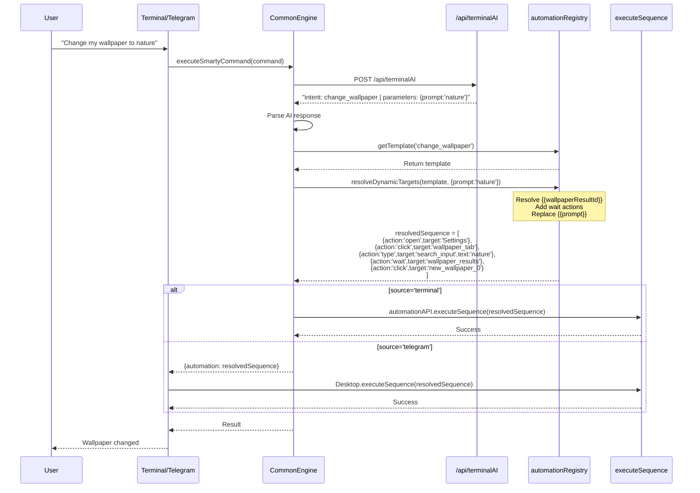

# Automation Architecture - Visual Flowchart

## Complete Architecture Diagram



---

## Terminal Flow (Detailed)



---

## Telegram Flow (Detailed)



---

## AI-Powered Flow (Detailed)



---

## Component Responsibilities

### 1. Common Command Engine (`lib/commonCommandEngine.tsx`)

**Role:** Single source of truth for command parsing and automation resolution

**Responsibilities:**
- Parse special commands (settings, pdf, etc.)
- Parse direct actions (open/close/maximize)
- Call AI API for intelligent commands
- Resolve automation templates via registry
- Return same sequence format for all sources

**Key Functions:**
```typescript
executeSmartyCommand(command, context)
├── parseSpecialCommands()
├── parseDirectActions()
└── parseAIResponseAndExecute()
    ├── automationRegistry.resolveDynamicTargets()
    └── Returns resolved sequence
```

---

### 2. Automation Registry (`lib/automationRegistry.ts`)

**Role:** Maps intents to executable workflows

**Responsibilities:**
- Load templates from `data/dekstop.json`
- Resolve `{{variable}}` parameters
- Handle dynamic targets (wallpaper results, themes)
- Add wait actions for dynamic elements
- Return fully resolved sequences

**Key Functions:**
```typescript
automationRegistry
├── getTemplate(intent)
├── resolveParameters(template, params)
├── hasDynamicTargets(template)
└── resolveDynamicTargets(template, params, context)
    ├── Wait for elements to load
    ├── Replace {{variable}} with actual values
    └── Return ready-to-execute sequence
```

---

### 3. Terminal Handler (`lib/handleCommand.tsx`)

**Role:** Execute commands from Terminal UI

**Responsibilities:**
- Display "Thinking..." message
- Call `executeSmartyCommand()`
- Display results in terminal
- Update input/output history

**Flow:**
```typescript
handleCommand(automationAPI, command)
├── Display "Thinking..."
├── executeSmartyCommand(command, {source:'terminal', automationAPI})
├── automationAPI.executeSequence() [inside commonCommandEngine]
└── Display result
```

---

### 4. Telegram Handler (`lib/telegram/ai.ts`)

**Role:** Execute commands from Telegram Bot

**Responsibilities:**
- Check permissions
- Verify desktop connection
- Call `executeSmartyCommand()`
- Send sequence via WebSocket
- Wait for desktop response

**Flow:**
```typescript
processAutomationCommand(command, userId)
├── Check permissions
├── Check desktop online
├── executeSmartyCommand(command, {source:'telegram', automationAPI:null})
├── socket.emit('automation-command', {sequence})
├── registerPendingCommand(commandId) [wait for response]
└── Return result to Telegram
```

---

### 5. Desktop WebSocket Handler (`components/Dekstop/deskstop.tsx`)

**Role:** Execute automation sequences from WebSocket

**Responsibilities:**
- Receive 'automation-command' events
- Execute via `automationAPI.executeSequence()`
- Send result back via 'automation-result'

**Flow:**
```typescript
socket.on('automation-command', handleTelegramCommand)
handleTelegramCommand(data)
├── automationAPIRef.current.executeSequence(data.sequence)
├── socket.emit('automation-result', {success})
└── Display toast notification
```

---

## Data Flow

### Command Context

```typescript
interface CommandContext {
  userId?: string;
  source: 'terminal' | 'telegram' | 'voice' | 'api';
  userProfile?: any;
  automationAPI: any;  // null for remote sources
}
```

### Command Result

```typescript
interface CommandResult {
  success: boolean;
  message: string | JSX.Element;
  automation?: any[];  // ← Resolved sequence
  events: CommandEvent[];
}
```

### Automation Sequence

```typescript
type AutomationSequence = Array<{
  action: 'open' | 'close' | 'minimize' | 'maximize' | 'focus' | 'click' | 'type' | 'wait';
  target: string;
  text?: string;
  delay?: number;
  params?: any;
}>
```

### WebSocket Payload

```typescript
interface WebSocketPayload {
  requestId: string;
  commandId: string;
  userId: string;
  sequence: any[];  // ← Automation sequence
  source: 'telegram' | 'api';
  timestamp: number;
}
```

---

## Testing Checklist

### Direct Commands
- [ ] Terminal: `open chrome` → Chrome opens
- [ ] Telegram: `/open chrome` → Chrome opens
- [ ] Terminal: `close Terminal` → Terminal closes
- [ ] Telegram: `/close Terminal` → Terminal closes

### AI Commands
- [ ] Terminal: "Change wallpaper to nature" → Wallpaper changes
- [ ] Telegram: "Change wallpaper to nature" → Wallpaper changes
- [ ] Terminal: "Open Settings" → Settings opens
- [ ] Telegram: "Open Settings" → Settings opens

### Complex Automation
- [ ] Terminal: "Search for wallpapers and set first one" → Full sequence executes
- [ ] Telegram: "Search for wallpapers and set first one" → Full sequence executes

### Edge Cases
- [ ] Desktop offline: Telegram returns friendly error
- [ ] Webcam access lost: Camera feed handles gracefully
- [ ] App not found: Returns "App not found" message

---

## Success Metrics

✅ **Architecture Correctness:**
- Terminal and Telegram use same command engine ✓
- Both use automationRegistry.resolveDynamicTargets() ✓
- Both return same sequence format ✓
- Desktop uses same executor for both ✓

✅ **Code Quality:**
- No duplicate parsing logic ✓
- No Telegram-specific execution logic ✓
- Type-safe automation sequences ✓
- Clear separation of concerns ✓

✅ **Maintainability:**
- Single source of truth (commonCommandEngine) ✓
- Clear flow documentation ✓
- Testable architecture ✓
- Easy to extend (Voice, API) ✓
