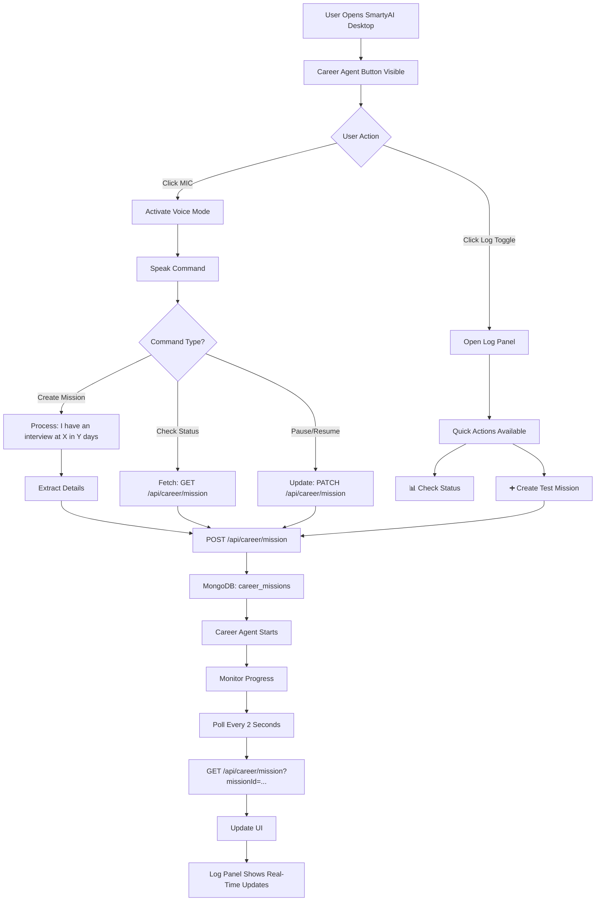
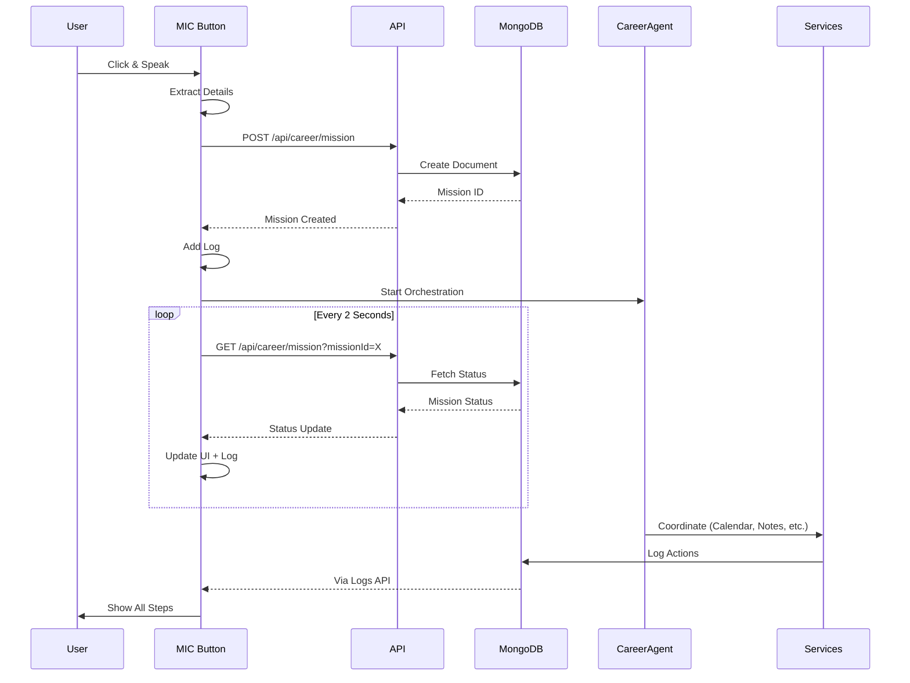
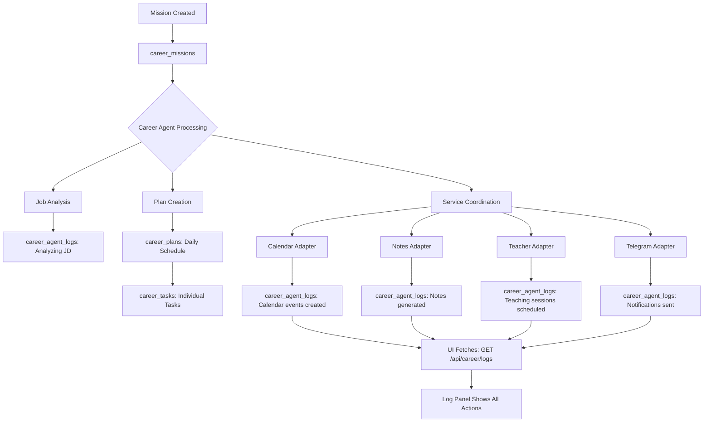
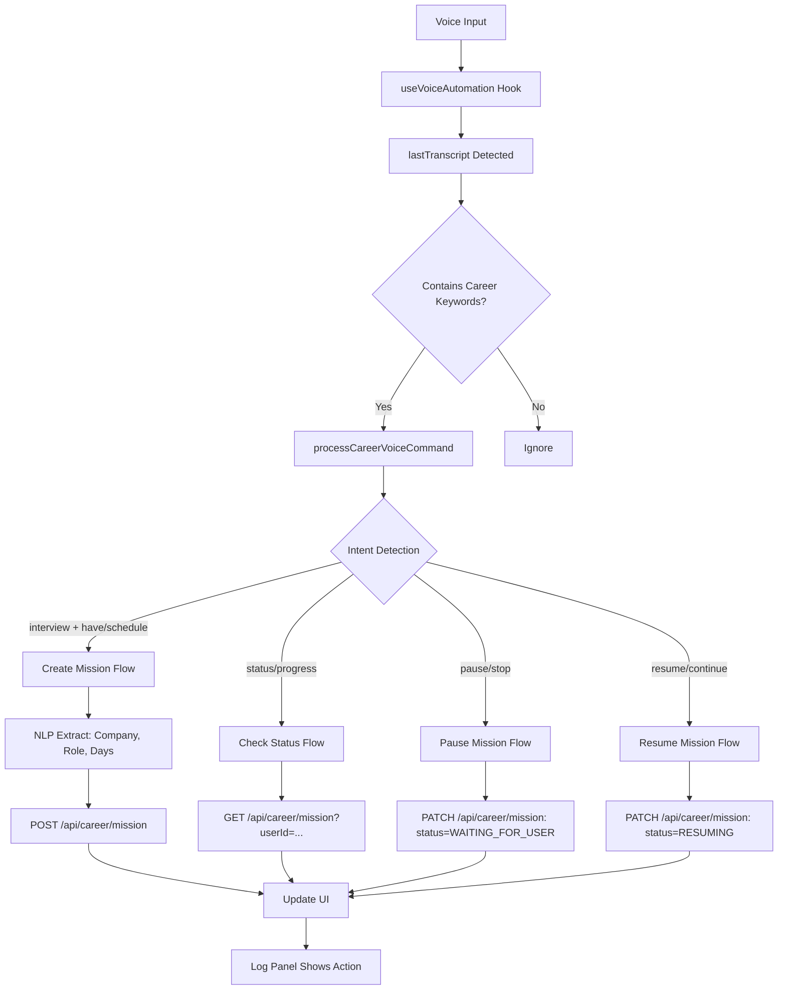
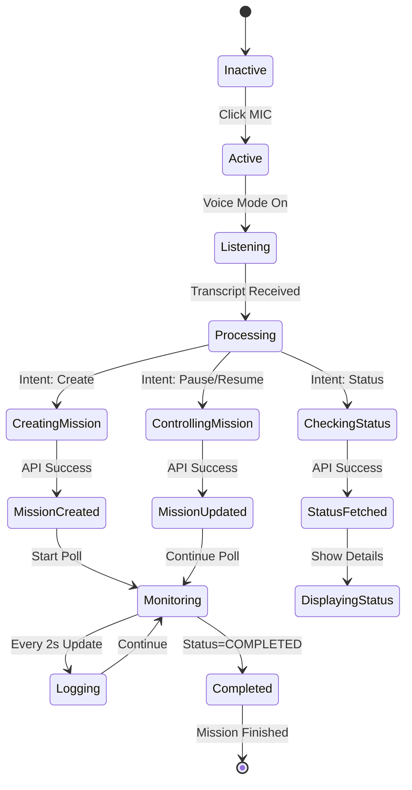

# Career Agent MIC Button - Complete Flow Diagram

## User Interaction Flow



## System Architecture

```mermaid
graph LR
    subgraph "Frontend"
        A[CareerAgentButton.tsx]
        B[useVoiceAutomation Hook]
        C[Log Panel UI]
    end
    
    subgraph "API Layer"
        D[/api/career/mission]
        E[/api/career/logs]
        F[/api/career/ai]
    end
    
    subgraph "Orchestration Layer"
        G[CareerAgent]
        H[CareerOrchestrator]
        I[CareerScheduler]
    end
    
    subgraph "Adapters"
        J[Calendar]
        K[Notes]
        L[Teacher]
        M[Telegram]
        N[VS Code]
        O[YouTube]
        P[ATS]
        Q[Mail]
    end
    
    subgraph "Data Layer"
        R[(MongoDB)]
        S[career_missions]
        T[career_tasks]
        U[career_agent_logs]
        V[career_plans]
    end
    
    A --> B
    B --> D
    D --> G
    G --> H
    H --> J & K & L & M & N & O & P & Q
    J & K & L & M & N & O & P & Q --> R
    R --> S & T & U & V
    E --> U
    C --> A
```

## Real-Time Update Flow



## MongoDB Collections Flow



## Voice Command Processing



## Log Panel States



## Data Flow Summary

```
┌─────────────────────────────────────────────────────────────┐
│ USER INTERACTION                                             │
│                                                               │
│  1. Click MIC Button (turns red + pulsing)                  │
│  2. Speak: "I have an interview at Google in 5 days"       │
│  3. Transcript appears in voice status                       │
│                                                               │
└───────────────────────┬─────────────────────────────────────┘
                        │
                        ▼
┌─────────────────────────────────────────────────────────────┐
│ VOICE PROCESSING                                             │
│                                                               │
│  • careerKeywords.test(transcript) → Match: "interview"     │
│  • processCareerVoiceCommand(transcript)                     │
│  • NLP Extract:                                              │
│    - Company: Google                                         │
│    - Role: Developer (fallback)                              │
│    - Days: 5                                                 │
│                                                               │
└───────────────────────┬─────────────────────────────────────┘
                        │
                        ▼
┌─────────────────────────────────────────────────────────────┐
│ API CALL                                                      │
│                                                               │
│  POST /api/career/mission                                    │
│  Body: {                                                     │
│    company: "Google",                                        │
│    role: "Developer",                                        │
│    interviewDate: "2026-08-31T...",                          │
│    priority: "high"                                          │
│  }                                                            │
│                                                               │
└───────────────────────┬─────────────────────────────────────┘
                        │
                        ▼
┌─────────────────────────────────────────────────────────────┐
│ MONGODB                                                       │
│                                                               │
│  career_missions.insertOne({                                 │
│    userId: ObjectId("..."),                                  │
│    company: "Google",                                        │
│    role: "Developer",                                        │
│    interviewDate: ISODate("2026-08-31"),                     │
│    status: "CREATED",                                        │
│    progress: 0                                               │
│  })                                                           │
│                                                               │
│  Returns: { insertedId: ObjectId("...") }                    │
│                                                               │
└───────────────────────┬─────────────────────────────────────┘
                        │
                        ▼
┌─────────────────────────────────────────────────────────────┐
│ CAREER AGENT ORCHESTRATION                                    │
│                                                               │
│  • CareerAgent.startMission() [async]                        │
│  • Phase 1: Analyze JD → jobProfile extracted                │
│  • Phase 2: Analyze Resume → skillGaps identified            │
│  • Phase 3: Create Plan → dailySchedule created              │
│  • Phase 4: Execute Services                                 │
│                                                               │
└───────────────────────┬─────────────────────────────────────┘
                        │
                        ▼
┌─────────────────────────────────────────────────────────────┐
│ SERVICE COORDINATION                                          │
│                                                               │
│  → Calendar Adapter:                                          │
│     • Check calendar.write permission                         │
│     • Create preparation events                               │
│     • Log: "Calendar events created"                         │
│                                                               │
│  → Notes Adapter:                                             │
│     • Generate interview notes                                │
│     • Log: "Interview notes generated"                       │
│                                                               │
│  → Teacher Adapter:                                           │
│     • Schedule teaching sessions                              │
│     • Log: "Teaching sessions scheduled"                     │
│                                                               │
│  → Telegram Adapter:                                          │
│     • Send notification                                       │
│     • Log: "Telegram notification sent"                     │
│                                                               │
└───────────────────────┬─────────────────────────────────────┘
                        │
                        ▼
┌─────────────────────────────────────────────────────────────┐
│ MONITORING (Every 2 Seconds)                                  │
│                                                               │
│  setInterval(() => {                                         │
│    GET /api/career/mission?missionId=X                       │
│    Parse: status, progress, skillGaps                        │
│    Update: activeMission state                               │
│    Update: currentStep text                                  │
│    Add: Logs to careerLogs array                             │
│    Render: UI updates                                        │
│  }, 2000)                                                     │
│                                                               │
└───────────────────────┬─────────────────────────────────────┘
                        │
                        ▼
┌─────────────────────────────────────────────────────────────┐
│ UI LOG PANEL                                                  │
│                                                               │
│  [🎯 Career Agent - Live Orchestration]                      │
│                                                               │
│  ✅ Mission Created: ID: 68e3f2a1b1234...                    │
│  ℹ️ Company: Google                                          │
│  ℹ️ Role: Developer                                          │
│  ℹ️ Interview Date: 8/31/2026                                │
│                                                               │
│  🎯 Orchestrator: Starting mission orchestration...          │
│  ℹ️ Phase 1: Analyzing job description                       │
│  ℹ️ Phase 2: Creating preparation plan                       │
│  ⚠️ Permission: Awaiting user approval                       │
│  ℹ️ Progress: 25% complete                                   │
│  ℹ️ Calendar events created                                  │
│  ℹ️ Interview notes generated                                │
│  ℹ️ Teaching sessions scheduled                              │
│  ✅ Telegram notification sent                               │
│                                                               │
└─────────────────────────────────────────────────────────────┘
```

---

## Complete Timeline Example

**User:** "I have an interview at Google in 5 days for Senior React Developer"

| Time | Event | Log Entry | MongoDB |
|------|-------|-----------|---------|
| 0:00 | MIC button clicked | 🟢 Voice Active | - |
| 0:02 | Transcript received | "I have an interview at Google..." | - |
| 0:03 | Processing detected | 🎯 Processing voice | - |
| 0:04 | Details extracted | Company: Google, Role: React Developer, Days: 5 | - |
| 0:05 | API call starts | POST /api/career/mission | - |
| 0:06 | MongoDB insert | ✅ Mission Created: ID: 68e3... | career_missions: 1 doc |
| 0:07 | Orchestration starts | 🎯 Starting orchestration | - |
| 0:09 | Phase 1 begins | ℹ️ Analyzing JD | career_agent_logs: 1 entry |
| 0:12 | Phase 2 begins | ℹ️ Creating plan | career_agent_logs: 2 entries |
| 0:15 | Permission check | ⚠️ Awaiting permission | career_agent_logs: 3 entries |
| 0:17 | User approves | ✅ Permission granted | career_missions.status: EXECUTING |
| 0:20 | Calendar events | ℹ️ Calendar created | career_agent_logs: 4 entries |
| 0:23 | Notes generated | ℹ️ Notes created | career_agent_logs: 5 entries |
| 0:26 | Teacher scheduled | ℹ️ Sessions scheduled | career_agent_logs: 6 entries |
| 0:29 | Telegram sent | ✅ Notification sent | career_agent_logs: 7 entries |
| 0:32 - 5:00 | Monitoring continues | Progress: 25% → 50% → 75% | career_agent_logs: updates |
| 5:00 | Complete | ✅ Mission completed | career_missions.status: COMPLETED |

---

**This is how every step of Career Agent orchestration is visible in real-time!**
