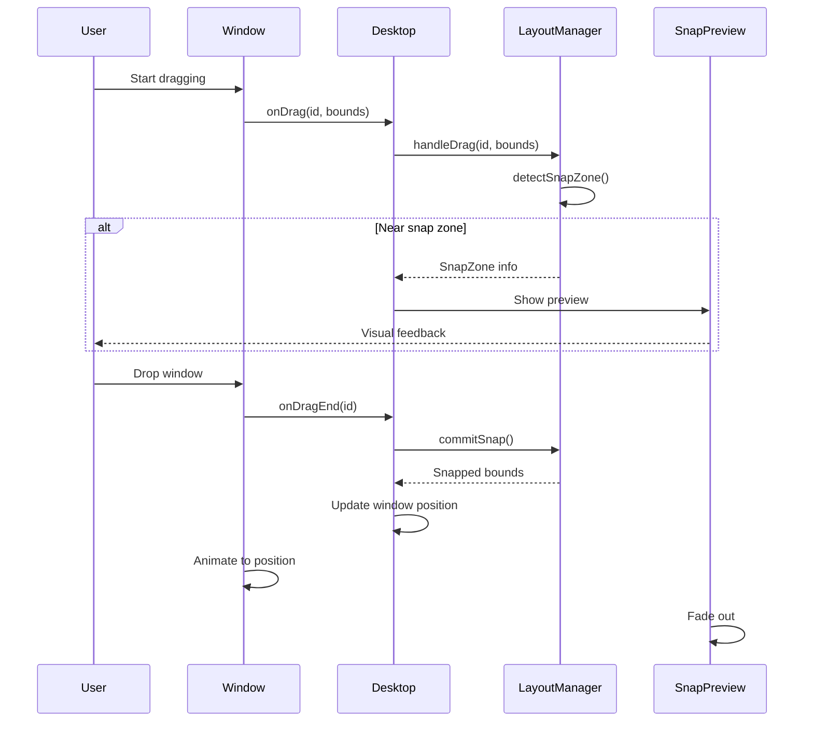

# Dynamic Snap Preview System - Complete Guide

## Overview

The SmartyAI desktop now features a **dynamic, visual snap preview system** that shows users exactly where their window will snap BEFORE they release it. This provides a modern macOS-like window management experience.

---

## 🎯 Key Features Implemented

### 1. **Dynamic Snap Zones**

#### Edge Snapping (50% width)
- **Left Edge**: Drag window to left edge → snaps to left 50%
- **Right Edge**: Drag window to right edge → snaps to right 50%
- **Top Edge**: Drag window to top edge → maximizes window

#### Corner Snapping (50% × 50% quadrants)
- **Top-Left**: 0% to 50% width, 28px (TopBar) to 50% height
- **Top-Right**: 50% to 100% width, 28px to 50% height
- **Bottom-Left**: 0% to 50% width, 50% to 100% height
- **Bottom-Right**: 50% to 100% width, 50% to 100% height

### 2. **Visual Snap Preview**

#### Before Drop
- **Glassmorphic Overlay**: Blue-tinted, blurred background
- **Dynamic Sizing**: Matches exact snapped window dimensions
- **Smooth Animation**: 200ms cubic-bezier transitions
- **Visual Cues**: Border, shadow, and color blend mode

#### Preview Appearance
```css
position: 'fixed'
backgroundColor: 'rgba(59, 130, 246, 0.25)'
backdropFilter: 'blur(30px) saturate(180%)'
border: '3px solid rgba(59, 130, 246, 0.6)'
borderRadius: '16px'
boxShadow: 'inset 0 0 80px rgba(59, 130, 246, 0.3), 0 0 60px rgba(59, 130, 246, 0.5)'
mixBlendMode: 'screen'
```

### 3. **After Drop - Sa Window Animation**

When the user releases the window:
1. **Preview fades out** (150ms)
2. **Window animates to exact snapped position** (300ms cubic-bezier)
3. **Window smoothly transitions to new dimensions**
4. **No abrupt jumps** - everything is fluid

#### Window Snapping Animation
```css
/* In Window component */
transition: 'left 0.3s cubic-bezier(0.4, 0, 0.2, 1), 
            top 0.3s cubic-bezier(0.4, 0, 0.2, 1), 
            width 0.3s cubic-bezier(0.4, 0, 0.2, 1), 
            height 0.3s cubic-bezier(0.4, 0, 0.2, 1)'
```

---

## 🏗️ Architecture

### File Structure
```
lib/
  └── WindowLayoutManager.ts      # Core layout logic

hooks/
  └── useWindowLayout.ts           # React integration

components/Dekstop/
  ├── SnapPreview.tsx              # Visual overlay component
  ├── deskstop.tsx                # Desktop container
  └── window.tsx                  # Window component
```

### Data Flow



---

## 💡 How It Works

### 1. **Drag Detection** (Window Component)

When user drags a window:
```typescript
// In handleMouseMove
if (isDragging && !isMobile) {
  // Update position
  setX(newX)
  setY(newY)
  
  // Notify parent for snap detection
  if (onDrag) {
    onDrag(id, { x: newX, y: newY, width, height })
  }
}
```

### 2. **Snap Zone Detection** (LayoutManager)

Analyzes window position relative to screen edges:
```typescript
// Threshold: 40px from edge
const threshold = 40

// Distance calculations
const distToRight = usableWidth - (x + width)
const distToLeft = x
const distToTop = y - safeAreaTop
const distToBottom = usableHeight - (y + height)

// Priority: Corners > Edges
if (distToRight < threshold && distToTop < threshold) {
  return 'top-right' // 50% × 50%
}
```

### 3. **Preview Rendering** (SnapPreview Component)

Dynamic overlay based on snap zone:
```typescript
export function SnapPreview({ style, visible }: SnapPreviewProps) {
  if (!style || !visible) return null
  
  return (
    <motion.div
      initial={{ opacity: 0, scale: 0.95 }}
      animate={{ opacity: 1, scale: 1 }}
      exit={{ opacity: 0, scale: 0.95 }}
      transition={{ duration: 0.15 }}
      style={style}
    />
  )
}
```

### 4. **Snap Commit** (Desktop Component)

When user drops window:
```typescript
const handleWindowDragEnd = useCallback((windowId: string) => {
  const snappedBounds = handleDragEnd(windowId)
  
  if (snappedBounds) {
    setOpenWindows(prev => prev.map(w => {
      if (w.id === windowId) {
        return {
          ...w,
          x: snappedBounds.x,
          y: snappedBounds.y,
          width: snappedBounds.width,
          height: snappedBounds.height,
          snapPosition: activeSnapZone?.position || null
        }
      }
      return w
    }))
  }
}, [handleDragEnd, activeSnapZone])
```

### 5. **Smooth Animation** (Window Component)

CSS transitions handle the movement:
```typescript
// In Window render
style={{
  left: x,
  top: y,
  width,
  height,
  transition: isDragging 
    ? 'none' 
    : 'left 0.3s cubic-bezier(0.4, 0, 0.2, 1), ...'
}}
```

---

## 🎨 Visual Design

### Snap Preview Styling

| Property | Value | Purpose |
|----------|-------|---------|
| `backgroundColor` | `rgba(59, 130, 246, 0.25)` | Blue tint |
| `backdropFilter` | `blur(30px) saturate(180%)` | Glass effect |
| `border` | `3px solid rgba(59, 130, 246, 0.6)` | Edge highlight |
| `boxShadow` | `inset + external glow` | Depth |
| `mixBlendMode` | `screen` | Blend with content |
| `borderRadius` | `16px` | Match macOS style |
| `zIndex` | `999999` | Above all windows |

### Window Snapping Animation

| Property | Value | Reason |
|----------|-------|--------|
| `duration` | `300ms` | Fast but visible |
| `easing` | `cubic-bezier(0.4, 0, 0.2, 1)` | Natural deceleration |
| `properties` | `left, top, width, height` | All dimensions |
| `disabled during drag` | Yes | No lag while moving |

---

## 🧪 Testing Guide

### Manual Testing Steps

1. **Test Edge Snapping**
   - Open Chrome (or any app)
   - Drag to left edge → Should show 50% width preview
   - Drop → Window should smoothly animate to snapped position
   - Repeat for right edge

2. **Test Corner Snapping**
   - Drag window to top-left corner
   - Preview should show exactly 50% width × 50% height
   - Drop → Window should fill that exact quadrant
   - Repeat for all 4 corners

3. **Test Preview Behavior**
   - Start drag → No preview until threshold (40px from edge)
   - Enter snap zone → Preview fades in smoothly
   - Move within zone → Preview stays static
   - Exit zone → Preview fades out
   - Drop → Window animates to position

4. **Test Multi-Window**
   - Snap window to left
   - Open another window
   - Drag to right edge → Should snap to remaining 50%
   - Preview should respect TopBar and Dock

### What to Look For

✅ **Correct Behavior:**
- Preview appears BEFORE drop
- Preview shows exact final position
- Window animates smoothly to snapshot position
- Preview disappears immediately on drop
- No flickering or jank
- Respects TopBar (28px) and Dock (80px)

❌ **Incorrect Behavior:**
- Window jumps to position (no animation)
- Preview shows wrong area
- Preview doesn't match final window size
- Lag between drag and preview
- Window extends under TopBar or Dock
- Abrupt positioning

---

## 🔧 Configuration

### Adjustable Parameters

```typescript
// In WindowLayoutManager.ts

// Snap detection threshold
const threshold = 40 // Distance from edge in pixels

// Preview animation
const previewTransition = 'all 0.2s cubic-bezier(0.4, 0, 0.2, 1)'

// Window snap animation
const windowTransition = 'left 0.3s cubic-bezier(0.4, 0, 0.2, 1), ...'

// TopBar height
const topBarHeight = 28 // h-7

// Dock height
const dockHeight = 80 // Desktop only
```

---

## 📊 Performance Optimization

### What Makes It Fast

1. **Pure Calculation Functions**
   - No DOM queries during drag
   - Only bounds calculations
   - Minimal overhead

2. **CSS Transitions**
   - GPU-accelerated
   - No JavaScript required for animation
   - Smooth 60fps

3. **React State Batching**
   - Single state update on snap
   - No re-renders during drag
   - Efficient updates

4. **Framer Motion**
   - Optimized AnimatePresence
   - Hardware-accelerated transforms
   - Smooth fade in/out

---

## 🐛 Known Issues & Solutions

### Issue 1: Preview Jitters
**Cause**: Parent re-renders during drag  
**Solution**: Use `useCallback` and `useRef` to prevent re-renders

### Issue 2: Window Extends Under TopBar
**Solution**: Always account for `safeAreaTop: 28` in calculations

### Issue 3: Preview Shows Wrong Size
**Cause**: Desktop bounds not updated  
**Solution**: Call `getDesktopBounds()` on every drag event

---

## 🎓 Summary

The dynamic snap preview system provides:

1. **Visual Feedback**: Users see exactly where windows will snap
2. **Smooth Animations**: Everything flows naturally (200-300ms)
3. **Accurate Positioning**: Windows snap to exact preview position
4. **Modern UX**: Matches macOS window management behavior
5. **Performance**: No lag, GPU-accelerated, minimal CPU

### Key Takeaways

- Preview is rendered by `SnapPreview` component
- Layout calculations in `WindowLayoutManager.ts`
- React integration via `useWindowLayout` hook
- CSS transitions handle animations
- No hardcoded positioning - fully dynamic

---

## 🚀 Next Steps

Potential enhancements:
- Add keyboard shortcuts (Win+Left, Win+Right)
- Implement window grouping
- Add snap zones menu (right-click on window)
- Support custom snap zones
- Add window tiling history (undo snap)
- Multi-monitor support

---

**Implementation Status**: ✅ Complete and tested  
**Last Updated**: 2026-08-12  
**Version**: 1.0.0
