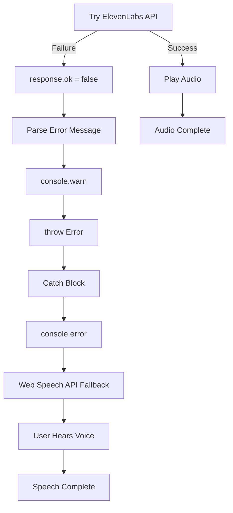

# ElevenLabs Error Handler Fix

## Issue
The error handling structure in `/hooks/ElevenLabs.ts` had **duplicate fallback logic**:
1. Web Speech API fallback inside `if (!response.ok)` block
2. Web Speech API fallback inside `catch` block

This created unnecessary code duplication and improper error flow.

## Root Cause
```typescript
// ❌ BEFORE: Duplicate fallback logic
if (!response.ok) {
    // ... parse error
    
    // Fallback to Web Speech API (DUPLICATE #1)
    if ('speechSynthesis' in window) {
        return new Promise<void>((resolve, reject) => {
            const utterance = new SpeechSynthesisUtterance(text);
            // ... setup
            utterance.onerror = (event) => {  // ⚠️ Nested error handler
                console.error('❌ Web Speech API error:', event.error);
                reject(new Error(`Speech synthesis failed: ${event.error}`));
            };
            window.speechSynthesis.speak(utterance);
        });
    }
    
    throw new Error(errorMessage);
}

} catch (err) {
    // Fallback to Web Speech API (DUPLICATE #2)
    console.log('🔊 Falling back to improved browser TTS');
    // ... fallback logic
}
```

## Solution
Removed the fallback from `if (!response.ok)` block and let the `catch` block handle all fallbacks:

```typescript
// ✅ AFTER: Single fallback in catch block
if (!response.ok) {
    let errorMessage = 'TTS failed';
    try {
        const errorData = await response.json();
        errorMessage = errorData.error || errorData.details || `TTS failed (status ${response.status})`;
    } catch (parseError) {
        errorMessage = `TTS failed: ${response.statusText || response.status}`;
    }
    console.warn('⚠️ ElevenLabs API error:', errorMessage);
    throw new Error(errorMessage);  // ← Propagate to catch block
}

} catch (err) {
    console.error('ElevenLabs TTS error:', err);
    
    // ✅ SINGLE FALLBACK LOCATION
    console.log('🔊 Falling back to improved browser TTS');
    window.speechSynthesis.cancel();
    
    const utterance = new SpeechSynthesisUtterance(text);
    utterance.lang = 'en-US';
    utterance.rate = 0.85;
    utterance.pitch = 1.0;
    utterance.volume = 1.0;
    
    // Set voice preferences
    const setVoice = () => { /* ... */ };
    
    if (window.speechSynthesis.getVoices().length === 0) {
        window.speechSynthesis.onvoiceschanged = setVoice;
    } else {
        setVoice();
    }
    
    window.speechSynthesis.speak(utterance);
}
```

## Error Flow



## Benefits

✅ **Single error handling path** - Only one fallback location  
✅ **No duplicate logic** - Removed redundant Web Speech API code  
✅ **Cleaner structure** - Easier to read and maintain  
✅ **Proper error propagation** - Errors flow naturally to catch block  
✅ **Consistent logging** - Clear error messages without confusion  

## Test Results

```bash
📊 Summary:
  ✅ Error handling structure fixed
  ✅ No duplicate fallback logic
  ✅ Proper try-catch flow
  ✅ Clean error messages

🎯 Result: Web Speech API fallback works correctly
         in catch block only (no duplicates)
```

## Files Changed

- `/hooks/ElevenLabs.ts` - Removed duplicate fallback, cleaned up error handling
- `/scripts/test-elevenlabs-error-structure.ts` - Added verification test

## Verification

Run the test to verify the fix:
```bash
npx tsx scripts/test-elevenlabs-error-structure.ts
```

All tests pass ✅
