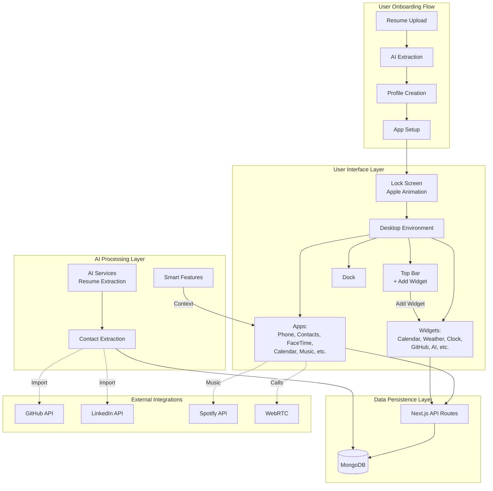
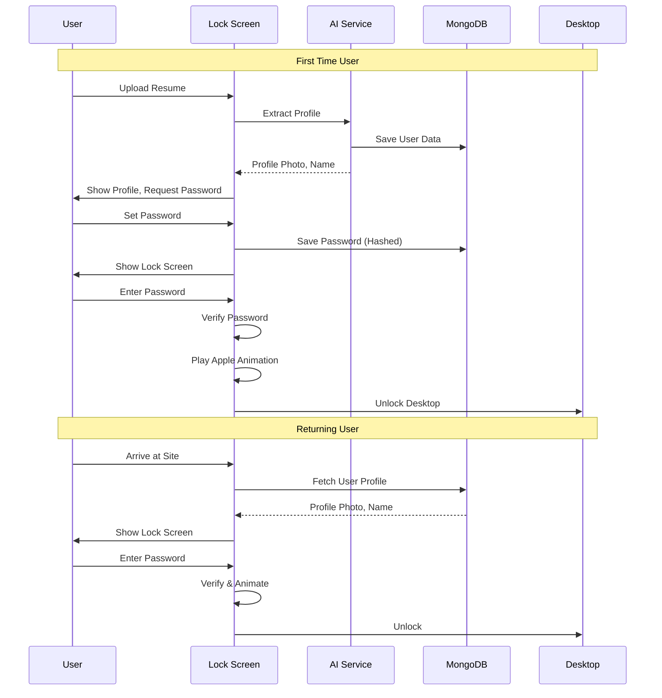
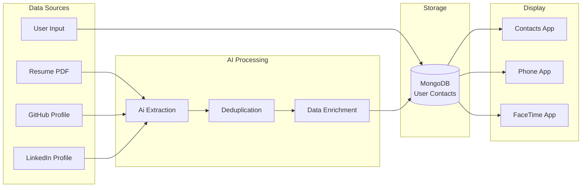
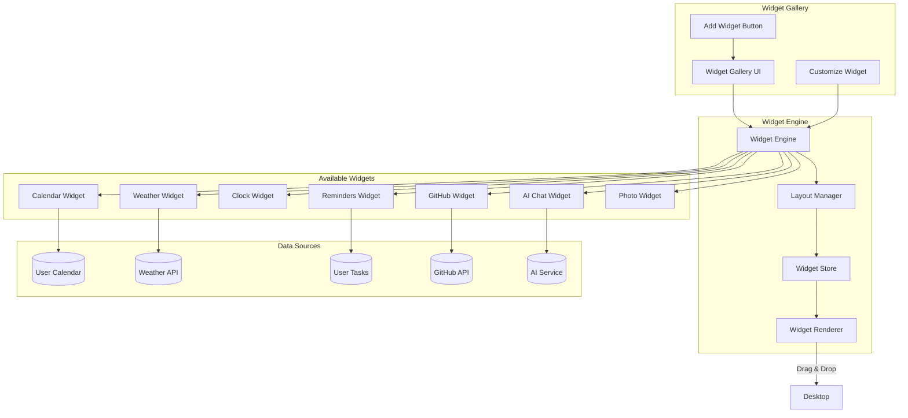
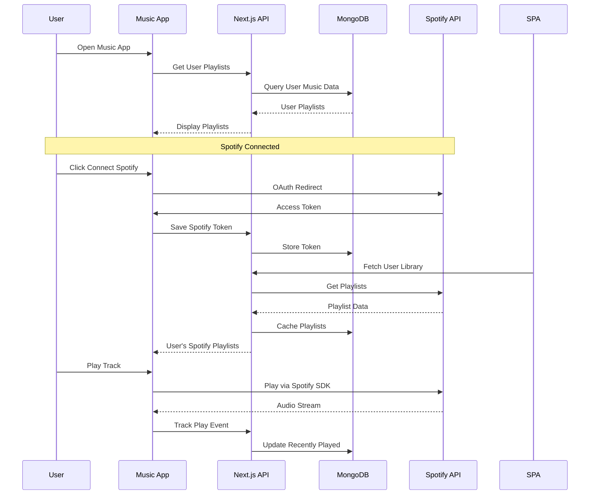
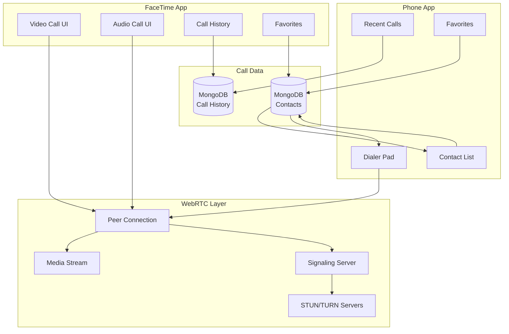
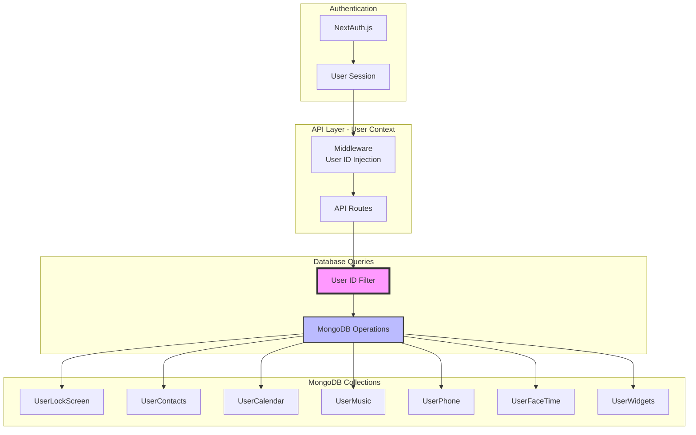

# SmartyAI + MacOS-Web-Simulator Architecture

## System Overview



## Component Architecture

### 1. Lock Screen Flow



### 2. Contacts App Flow



### 3. Widget System Architecture



### 4. Music App Integration



### 5. Phone & FaceTime Architecture



## Data Flow Architecture

### User-Specific Data Isolation



## Tech Stack Comparison

| Feature | MacOS-Web-Simulator | SmartyAI |
|---------|-------------------|----------|
| **Framework** | React + Vite | Next.js + React |
| **State** | Zustand (localStorage) | React Query + MongoDB |
| **Auth** | None (demo) | NextAuth.js |
| **Database** | localStorage | MongoDB |
| **AI** | None | OpenAI/Anthropic/GLM |
| **Integrations** | Spotify only | GitHub, LinkedIn, Spotify, etc. |
| **User Context** | Single user | Multi-user (SaaS) |
| **Deployment** | Static | Vercel + MongoDB Atlas |

## Component Reuse Strategy

### Step-by-Step Process

1. **Analyze Source Component**
   ```bash
   # Read component from MacOS-Web-Simulator
   cat /tmp/macos-simulator/src/app/Phone.jsx
   ```

2. **Extract UI Structure**
   - Keep JSX structure
   - Keep Tailwind classes
   - Keep styling logic
   - Keep component hierarchy

3. **Remove Static Data**
   ```tsx
   // BAD (from MacOS-Web-Simulator)
   const defaultContacts = [
     { id: "antonio", firstName: "Antonio", ... }
   ];

   // GOOD (SmartyAI)
   const { user } = useUser();
   const [contacts, setContacts] = useState([]);

   useEffect(() => {
     fetch(`/api/contacts/get?userId=${user.id}`)
       .then(res => res.json())
       .then(setContacts);
   }, [user]);
   ```

4. **Add User Context**
   ```tsx
   // Wrap component with user authentication
   import { useUser } from '@/lib/hooks/useUser';

   export default function PhoneApp({ windowId }) {
     const { user } = useUser();

     if (!user) {
       return <LoginPrompt />;
     }

     // Component logic
   }
   ```

5. **Implement API Endpoints**
   ```typescript
   // pages/api/phone/[action].ts
   export default async function handler(req, res) {
     const session = await getServerSession(req, res, authOptions);
     const userId = session.user.id;

     // All data operations scoped to userId
   }
   ```

6. **Connect to MongoDB**
   ```typescript
   // lib/db/models/user-phone.ts
   const UserPhoneSchema = new Schema({
     userId: { type: String, required: true, unique: true },
     // ... fields
   });
   ```

## Implementation Priority

### Critical Path (Must Have)
1. 🔒 **Lock Screen** - Onboarding entry point
2. 👥 **Contacts App** - Core user data from resume
3. 🗓️ **Calendar Enhancement** - Already exists, add MongoDB
4. ⬆️ **Widget System** - Desktop enhancement

### High Priority (Should Have)
5. 📞 **Phone App** - UI component, call history
6. 📹 **FaceTime App** - UI component, call history
7. 🎵 **Music App** - Spotify integration

### Nice to Have
8. 📸 **Photo Widget** - User photos
9. 🌤️ **Weather Widget** - Location-based
10. 📝 **Reminders App** - Task management

## File Structure

```
SmartyAI/
├── src/
│   ├── app/
│   │   ├── desktop/
│   │   │   ├── apps/
│   │   │   │   ├── PhoneApp.tsx         [NEW]
│   │   │   │   ├── ContactsApp.tsx      [NEW]
│   │   │   │   ├── FaceTimeApp.tsx      [NEW]
│   │   │   │   ├── CalendarApp.tsx      [ENHANCE]
│   │   │   │   ├── MusicApp.tsx         [NEW]
│   │   │   │   └── ...
│   │   │   ├── components/
│   │   │   │   ├── LockScreen.tsx       [NEW]
│   │   │   │   ├── TopBar.tsx           [UPDATE - Add Widget Button]
│   │   │   │   ├── WidgetGallery.tsx    [NEW]
│   │   │   │   └── ...
│   │   │   └── widgets/
│   │   │       ├── CalendarWidget.tsx   [NEW]
│   │   │       ├── WeatherWidget.tsx    [NEW]
│   │   │       ├── ClockWidget.tsx      [NEW]
│   │   │       ├── RemindersWidget.tsx  [NEW]
│   │   │       ├── GitHubWidget.tsx     [NEW]
│   │   │       ├── AIWidget.tsx         [NEW]
│   │   │       └── PhotoWidget.tsx      [NEW]
│   │   └── ...
│   └── lib/
│       ├── db/
│       │   └── models/
│       │       ├── user-lockscreen.ts   [NEW]
│       │       ├── user-contacts.ts     [NEW]
│       │       ├── user-phone.ts        [NEW]
│       │       ├── user-facetime.ts     [NEW]
│       │       ├── user-music.ts        [NEW]
│       │       ├── user-widgets.ts      [NEW]
│       │       └── user-calendar.ts     [UPDATE]
│       ├── ai/
│       │   ├── contact-extractor.ts     [NEW]
│       │   └── resume-extractor.ts      [UPDATE]
│       └── integrations/
│           ├── spotify.ts               [NEW]
│           └── webrtc/
│               ├── calling.ts           [NEW]
│               └── signaling.ts         [NEW]
├── pages/
│   └── api/
│       ├── auth/
│       │   └── unlock.ts               [NEW]
│       ├── contacts/
│       │   └── [action].ts             [NEW]
│       ├── phone/
│       │   └── [action].ts             [NEW]
│       ├── facetime/
│       │   └── [action].ts             [NEW]
│       ├── music/
│       │   └── [action].ts             [NEW]
│       ├── widgets/
│       │   └── [action].ts             [NEW]
│       └── calendar/
│           └── [action].ts             [UPDATE]
└── MACOS_SIMULATOR_INTEGRATION_PLAN.md [THIS FILE]
```

---

## Conclusion

This architecture ensures:
- ✅ User-specific data isolation
- ✅ Scalable MongoDB storage
- ✅ AI-powered features
- ✅ Reusable UI components from MacOS-Web-Simulator
- ✅ Modern authentication with NextAuth.js
- ✅ Real-time features with WebRTC
- ✅ Multi-platform integrations

**Next Step:** Start implementation with Lock Screen Component (critical for onboarding flow).
