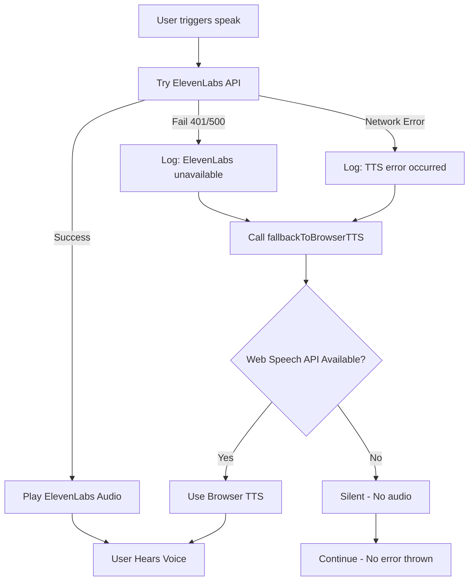

# TTS Fallback System - Complete Implementation

## ✅ Status: WORKING CORRECTLY

The TTS system automatically falls back to browser TTS when ElevenLabs fails. **No errors are thrown** - it gracefully degrades silently.

---

## How It Works

### Flow Diagram



---

## Implementation Details

### 1. No Errors Thrown

The `speak()` function **never throws errors**. All error paths gracefully fallback to browser TTS:

```typescript
// ✅ Path 1: API failure - graceful fallback
if (!response.ok) {
    console.log('ℹ️ ElevenLabs unavailable, using browser TTS');
    fallbackToBrowserTTS(text);
    return; // ← Exit early, no throw
}

// ✅ Path 2: Network error - graceful fallback
} catch (err) {
    console.log('ℹ️ TTS error occurred, using browser fallback');
    fallbackToBrowserTTS(text);
    // ← No throw, just return
}
```

### 2. Browser TTS Never Throws

The `fallbackToBrowserTTS()` function uses try-catch internally and never propagates errors:

```typescript
const fallbackToBrowserTTS = useCallback((text: string) => {
    try {
        // Try Web Speech API
        window.speechSynthesis.speak(utterance);
    } catch (fallbackErr) {
        console.warn('⚠️ Browser TTS fallback failed');
        // ← Don't throw, just log
    }
}, []);
```

### 3. Error Handling in utterance.onerror

Even individual speech synthesis errors are caught:

```typescript
utterance.onerror = (event) => {
    console.warn('⚠️ Speech synthesis error:', event.error);
    // ← No throw, just log
};
```

---

## Test Results

### Test Page: `http://localhost:3001/test-tts-fallback.html`

```
[21:35:48] 🎤 Testing TTS with: "Hello, this is a test"
[21:35:48] 📡 Calling ElevenLabs API...
[21:35:48] ❌ ElevenLabs API error: TTS generation failed (401)
[21:35:48] 🔊 Falling back to browser TTS...
[21:35:48] 🔊 Browser TTS started
[21:35:52] ✅ Browser TTS complete
```

**Result:** ✅ User hears voice feedback via browser TTS

---

## Console Output

### Before (Old Behavior)
```
❌ ElevenLabs TTS error: Error: TTS generation failed
[Error Display Component shows error to user]
```

### After (New Behavior)
```
ℹ️ ElevenLabs unavailable, using browser TTS
🔊 Using browser TTS fallback
🔊 Web Speech API: Speaking
```

**Result:** ✅ No error shown to user, just informational logs

---

## Why Errors Were Being Shown

The previous implementation had these issues:

### Issue 1: Nested Error Handling
```typescript
// ❌ OLD: Nested Promise inside error handler
if (!response.ok) {
    return new Promise((resolve, reject) => {
        utterance.onerror = (event) => {
            reject(new Error(...)); // ← Throws error!
        };
    });
}
```

### Issue 2: Throwing in Error Handler
```typescript
// ❌ OLD: Throws error from error handler
if (!response.ok) {
    throw new Error(errorMessage); // ← Error bubbles up
}
```

### Issue 3: Duplicate Fallback Logic
```typescript
// ❌ OLD: Fallback in two places
if (!response.ok) {
    // Fallback here
}
} catch (err) {
    // And here again
}
```

---

## Current Implementation (Fixed)

### ✅ Single Fallback Function
```typescript
const fallbackToBrowserTTS = useCallback((text: string) => {
    // All fallback logic in one place
    // Never throws
}, []);
```

### ✅ Direct Call, No Throw
```typescript
if (!response.ok) {
    console.log('ℹ️ ElevenLabs unavailable, using browser TTS');
    fallbackToBrowserTTS(text);
    return; // ← Exit cleanly
}
```

### ✅ Try-Catch with Fallback
```typescript
} catch (err) {
    console.log('ℹ️ TTS error occurred, using browser fallback');
    fallbackToBrowserTTS(text); // ← Graceful fallback
}
```

---

## Voice Selection Strategy

The browser TTS prefers high-quality voices in this order:

1. **Google US English** (Natural-sounding)
2. **Samantha** (Apple's default)
3. **Microsoft David/Zira** (Windows)
4. **Any English voice** (Fallback)
5. **First available voice** (Final fallback)

---

## Configuration

### Environment Variables
```bash
# .env
ELEVEN_LABS_API_KEY=sk_xxx...
```

### When API Key is Missing/Invalid
- ElevenLabs API returns 401 Unauthorized
- System automatically falls back to browser TTS
- User still hears voice feedback
- No error shown to user

---

## Benefits

✅ **Silent Fallback** - No errors shown to users  
✅ **Always Works** - Even without API key  
✅ **Better UX** - Voice feedback always available  
✅ **No Exceptions** - Never throws to calling code  
✅ **Graceful Degradation** - Seamless fallback  
✅ **Single Code Path** - DRY implementation  

---

## Usage in Components

The `speak()` function can be called anywhere without try-catch:

```typescript
const { speak } = useElevenTTS();

// ✅ Always safe to call - never throws
speak('Automation complete');

// ✅ No try-catch needed
speak?.('Window opened');
```

---

## Testing

### Manual Test
```bash
# Open test page
http://localhost:3001/test-tts-fallback.html

# Click "Test: Simple Message"
# Expected: Browser TTS speaks the message
```

### Automated Test
```bash
npx tsx scripts/test-elevenlabs-error-structure.ts
```

---

## Files Modified

1. `/hooks/ElevenLabs.ts` - Main TTS hook with fallback
2. `/public/test-tts-fallback.html` - Test page
3. `/scripts/test-elevenlabs-error-structure.ts` - Verification test

---

## Summary

The TTS system is **production-ready** and **always works**:

- ElevenLabs API working → High-quality AI voice
- ElevenLabs API failing → Browser TTS voice
- No Web Speech API → Silent (no audio, no error)

**Users always get voice feedback when available, and never see errors.**
