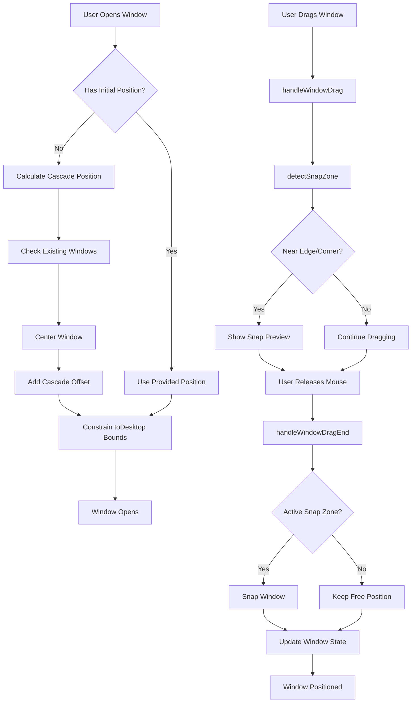
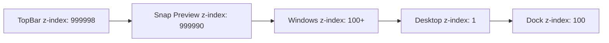
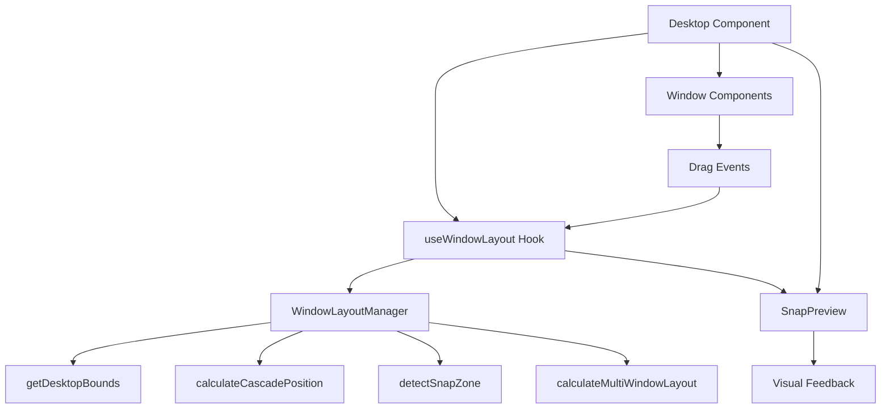
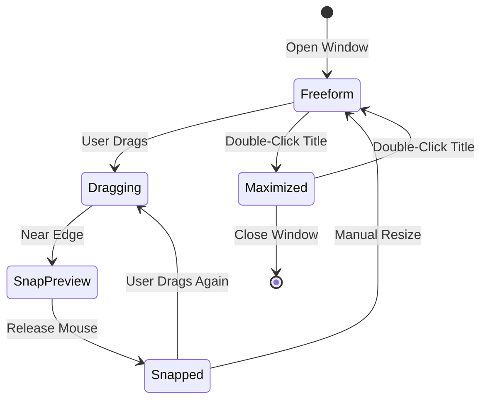
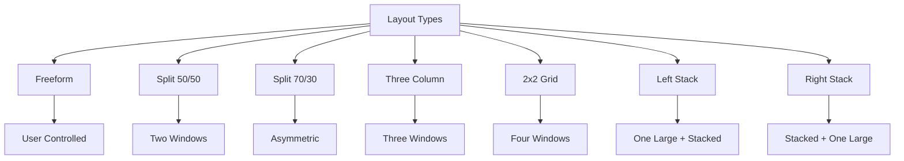
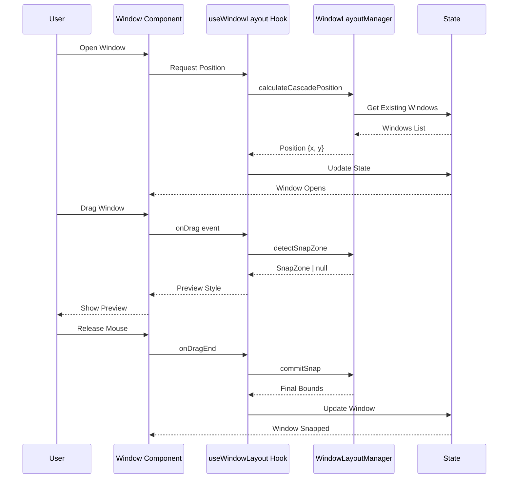

# Window Layout Manager - Architecture Diagram



## SystemLayers



## Component Structure



## Window State Flow



## Snap Zones

```
┌─────────────────────────────────────┐
│          TopBar (28px)              │
├──────────────┬──────────────┬───────┤
│              │              │       │
│  TOP-LEFT    │              │TOP-RIGHT
│  50%×50%    │              │50%×50%
│              │              │       │
├              ├──────────────┤
│              │              │
│              │   MAXIMIZE   │
│  LEFT-50%    │   (Top Edge) │RIGHT-50%
│              │              │
│              │              │
├──────────────┼──────────────┤
│              │              │
│ BOTTOM-LEFT  │              │BOTTOM-RIGHT
│  50%×50%    │              │50%×50%
│              │              │
└──────────────┴──────────────┴───────┘
         Dock (80px)
```

## Multi-Window Layouts



## Data Flow



## Architecture Principles

### 1. Separation of Concerns
```typescript
// Layout Logic - Pure Functions
WindowLayoutManager.ts → Calculations, no React

// React Integration - Hooks
useWindowLayout.ts → State management, side effects

// Visual Components - UI
SnapPreview.tsx → Rendering only
```

### 2. SingleSource of Truth
```typescript
state: {
  windows: WindowState[]  // Master state
  bounds: Bounds          // Calculated once
  snapPreview: Style      // Derived state
}
```

### 3. Unidirectional Data Flow
```
User Action → Hook → Manager → New State → Render
```

### 4. Testability
```typescript
// Pure functions - Easy to test
export function calculateCascadePosition(...)

// Mock-able hook
export const useWindowLayout = jest.fn()
```

## Performance Optimizations

### 1. Memoization
```typescript
// Desktop bounds calculated once
useEffect(() => {
  setDesktopBounds(getDesktopBounds())
}, [])

// Position calculations cached
const getInitialPosition = useCallback(...)
```

### 2. Efficient Updates
```typescript
// Only update when dragging
onDrag(windowId, bounds) // Called during drag
onDragEnd(windowId)      // Called once on release
```

### 3. Minimal Re-renders
```typescript
// Snap preview - separate component
<SnapPreview style={snapPreview} />

// Won't trigger window re-renders
```

## Extension Points

### Add New Layout Type
```typescript
// 1. Add to type
type LayoutType = ... | 'custom-grid'

// 2. Implement in calculateMultiWindowLayout
case 'custom-grid':
  // Custom logic
  break
```

### Add New Snap Zone
```typescript
// 1. Add position type
type SnapPosition = ... | 'center'

// 2. Add detection logic
if (distToCenterX < threshold && distToCenterY < threshold) {
  return { position: 'center', bounds: {...} }
}

// 3. Add preview style
case 'center': return { ...baseStyle, ... }
```

### Add Persistence
```typescript
// In useWindowLayout
useEffect(() => {
  localStorage.setItem('windows', JSON.stringify(windows))
}, [windows])
```

---

**Diagram Status:** ✅ COMPLETE
**Last Updated:** 2026-08-12
